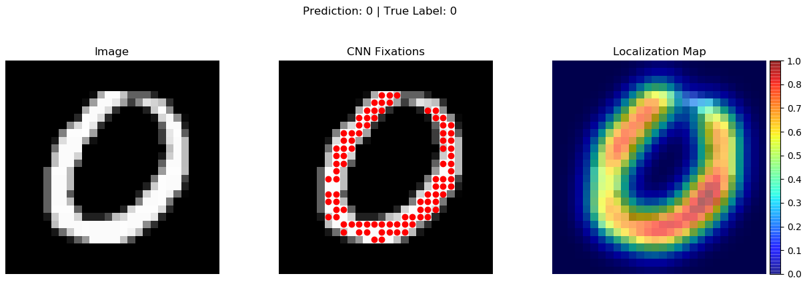
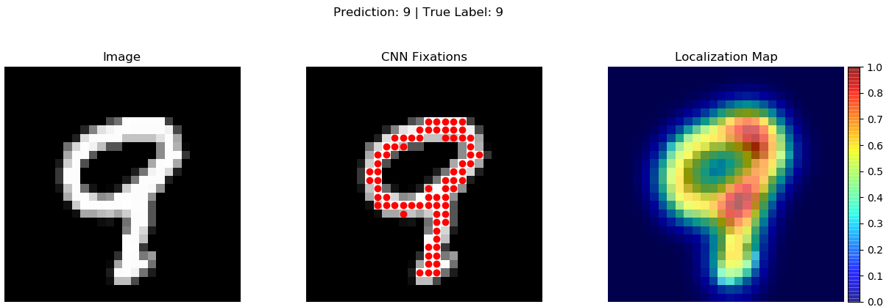

# CNN-Fixations-PyTorch

An impementation of CNN Fixations for PyTorch.

## Installation

* Install the pytorch and torchvision version fitting your system from https://pytorch.org/
* Install required packages: `pip install -r requirements.txt`

## Run instructions

For running the mnist example use command:
`python visualize_mnist.py --test-batch-size [batch_size] --visualize-model "saved_models/mnist_cnn.pt" --no-cuda`

## Add custom functions

* Create a new Fixations class that inhertis from Fixations located in 'cnn_fixations/fixations'
* All information needed to compute fixations is obtained from the inhertied 'self._layer_info_dict' dicationary.
  * The dictionary is of the form: dict\[module\] = \[LayerInfo1, LayerInfo2, ...\].
  * A module can be used multiple times in a model, but a LayerInfo object is spesific to a particular forward pass of that module.
    * A LayerInfo object contains: The name of the module it belongs to, and the input and output of a particular forward pass of that module.
  * To keep track and use the right LayerInfo object when a module is used multiple times in a model; make sure to pop() off the list of LayerInfo objects before leaving the custom function (see Fixations class on how it is done).

## TODO

* Make the code run faster/more efficiently
* Add support for more basic PyTorch modules such as:
  * Dropout
  * Various kinds of pooling
